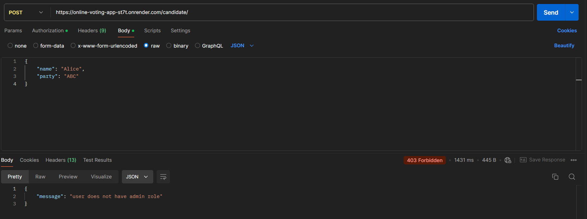
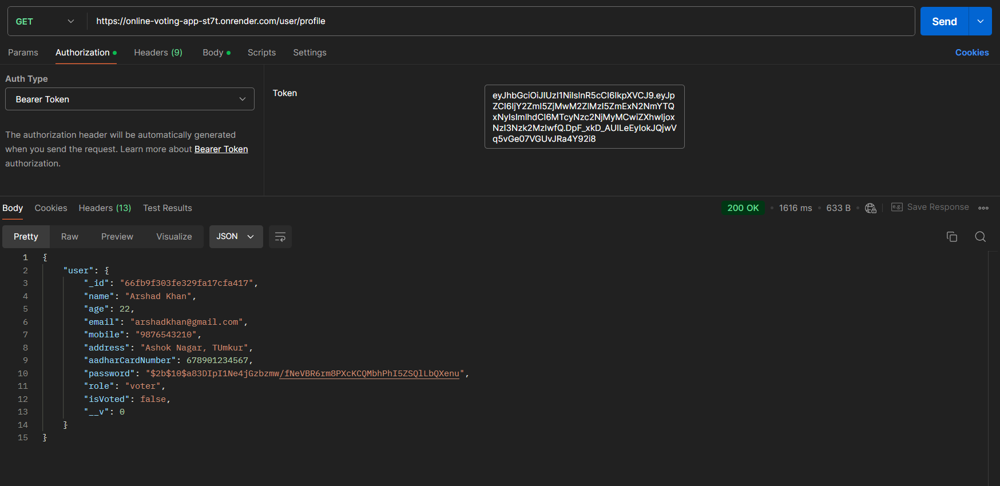
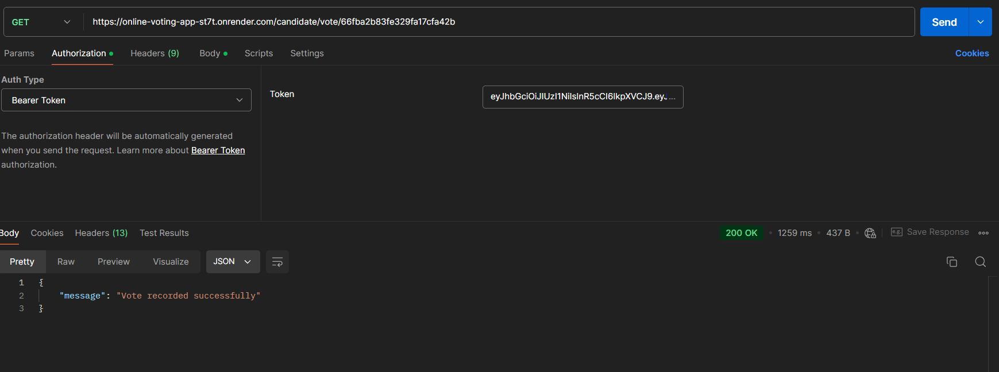

# Online Voting App 


## Description

This project is the backend for an online voting application designed for class elections. It supports managing candidates, users, voting, and counting votes. The project is currently hosted and accessible via the following link: [Online Voting App](https://online-voting-app-st7t.onrender.com/candidate/result)

To interact with the API, please use Postman or a similar tool to send HTTP requests. The API is designed to handle CRUD operations for candidates, user authentication, voting, and retrieving vote counts.

## Features

- **User Authentication:** Secure login and signup for users. Admin and voter roles are supported.
- **Manage Candidates:** Admins can add, update, and delete candidates for the election.
- **Voting:** Users can cast votes for candidates (one vote per user).
- **Vote Counting:** Retrieve the count of votes for each candidate.
- **Password Management:** Users can change their password.
- **JWT Token Authorization:** Secure endpoints using JWT-based authentication.

## Results

<table>
    <tr>
        <td></td>
        <td></td>
    </tr>
    <tr>
        <td></td>
        <td></td>
    </tr>
    <tr>
        <td></td>
        <td></td>
    </tr>
</table>

## Technologies Used

- **Node.js** with **Express** for server-side logic.
- **MongoDB** with **Mongoose** for database management.
- **JWT** for secure user authentication.
- **bcrypt** for password hashing.
- **dotenv** for environment variable management.
  
## Endpoints

### User Authentication

1. **POST /user/signup**  
   Register a new user. Requires data like `name`, `age`, `aadharCardNumber`, `password`, etc.

2. **POST /user/login**  
   Log in with `aadharCardNumber` and `password` to receive a JWT for authentication.

3. **GET /user/profile**  
   Retrieves the current user's profile. Requires a valid JWT.

4. **PUT /user/profile/password**  
   Allows the user to change their password. Requires current password and a valid JWT.

### Candidate Management

1. **GET /candidate**  
   Retrieves a list of all candidates with their `name` and `party`.

2. **POST /candidate**  
   Adds a new candidate (admin access required). Requires `name`, `party`, and `age`.

3. **PUT /candidate/:candidateID**  
   Updates the details of a specific candidate by their ID (admin access required).

4. **DELETE /candidate/:candidateID**  
   Deletes a candidate by their ID (admin access required).

### Voting

1. **GET /candidate/vote/:candidateID**  
   Records a vote for the specified candidate. Requires user authentication and limits to one vote per user.

2. **GET /candidate/vote/count**  
   Retrieves the current vote count for all candidates, sorted by the highest vote count.

### Admin-Only Features

1. **POST /candidate**  
   Only admin users can create new candidates using this endpoint.

2. **PUT /candidate/:candidateID**  
   Admin users can update candidate details like `name`, `party`, and `age`.

3. **DELETE /candidate/:candidateID**  
   Admin users can delete candidates by their ID.

## Authentication

JWT-based authentication is required for specific actions like voting, candidate management, and viewing profiles. Admins have extra privileges to manage candidates. Non-admin users are restricted from managing candidate data and can only vote once.

## How to Run

### Prerequisites

- **Node.js** and **npm** should be installed on your machine.
- **MongoDB** (either locally or using a cloud service like MongoDB Atlas).

### Setup and Installation

1. Clone the repository:

    ```bash
    git clone https://github.com/Arshad-khan05/Online-Voting-App.git
    ```

2. Navigate to the project directory:

    ```bash
    cd Online-Voting-App
    ```

3. Install the dependencies:

    ```bash
    npm install
    ```

4. Set up your environment variables (e.g., MongoDB connection string, JWT secret):

    ```bash
    PORT=3000
    mongoURLlocal=mongodb://localhost:27017/VotingApp
    JWT_SECRET=your_jwt_secret
    ```

5. Start the server:

    ```bash
    npm start
    ```

### Usage

Once the server is running, you can access the application through Postman, or any REST client. Use the endpoints described above to manage users, candidates, and votes.


